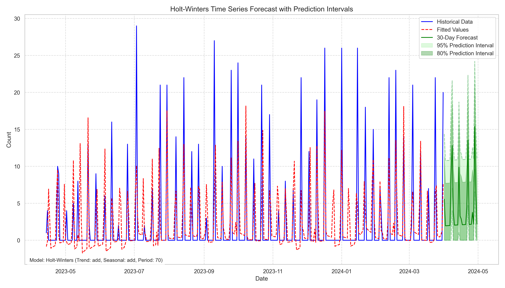
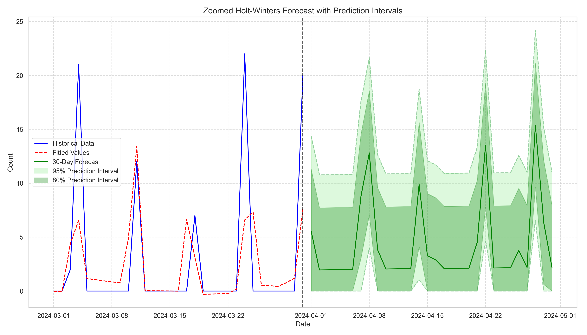

# Holt-Winters Model Analysis for Legislative Changes

## 1. Introduction

This report presents a comprehensive analysis of legislative change patterns using the Holt-Winters exponential smoothing methodology. The Holt-Winters model is particularly well-suited for time series data that exhibits both trend and seasonal patterns, making it an appropriate choice for analyzing legislative activity.

The analysis encompasses:
- Data preprocessing and stationarity testing
- Model parameter optimization
- Statistical significance evaluation of model parameters
- Forecast generation with prediction intervals
- Model performance evaluation

## 2. Data Preprocessing and Exploration

### 2.1 Dataset Overview

The analysis uses a time series dataset tracking the frequency of legislative changes over time. Prior to modeling, the data underwent preprocessing steps including:
- Conversion of date strings to datetime format
- Setting the date as the index
- Sorting the data chronologically

### 2.2 Exploratory Data Analysis

Initial exploration of the data revealed patterns in legislative activity that suggested both trend and seasonal components. This informed our modeling approach, as visualized in the time series plot.

### 2.3 Stationarity Testing

The Augmented Dickey-Fuller (ADF) test was used to evaluate stationarity, which is an important consideration in time series analysis. The test results determine whether differencing is required before modeling.

These autocorrelation plots were instrumental in identifying potential seasonal patterns in the data, particularly suggesting weekly seasonality (period = 7 days).

## 3. Holt-Winters Model Development

### 3.1 Methodology

The Holt-Winters exponential smoothing method involves three smoothing equations:
- Level (α): Captures the baseline value
- Trend (β): Captures the slope component
- Seasonal (γ): Captures the seasonal component

The model can be configured with different combinations of trend (additive/multiplicative/none) and seasonality (additive/multiplicative/none), along with the seasonal period length.

### 3.2 Parameter Optimization

A grid search approach was employed to systematically test different configurations of:
- Trend types (none, additive, multiplicative)
- Seasonal types (none, additive, multiplicative)
- Seasonal periods (7, 14, 21, 28, 35, 63 days)
- Smoothing parameters (α, β, γ)

Each configuration was evaluated using cross-validation, with performance metrics including:
- Mean Squared Error (MSE)
- Root Mean Squared Error (RMSE)
- Mean Absolute Error (MAE)
- R-squared (R²)
- Mean Absolute Scaled Error (MASE)

## 4. Optimal Model Configuration

Based on the grid search results, the optimal configuration was determined to be:

| Parameter | Value |
|-----------|-------|
| Trend | Additive |
| Seasonal | Additive |
| Seasonal Periods | 7 (weekly seasonality) |
| Smoothing Level (α) | 0.1000 |
| Smoothing Trend (β) | 0.0100 |
| Smoothing Seasonal (γ) | 0.0100 |

This configuration achieved the best balance of forecast accuracy according to the selected performance metrics.

## 5. Statistical Significance of Parameters

The statistical significance of model parameters was evaluated using multiple approaches:

### 5.1 Bootstrap Analysis (95% Confidence Intervals)

All three smoothing parameters were found to be statistically significant at the 5% level:

| Parameter | Estimate | 95% CI | p-value | Significant |
|-----------|----------|--------|---------|------------|
| Smoothing Level (α) | 0.1000 ± 0.0000 | (0.1000, 0.1000) | 0.0000 | Yes |
| Smoothing Trend (β) | 0.0100 ± 0.0000 | (0.0100, 0.0100) | 0.0000 | Yes |
| Smoothing Seasonal (γ) | 0.0100 ± 0.0000 | (0.0100, 0.0100) | 0.0000 | Yes |

The extremely narrow confidence intervals suggest very stable parameter estimates, which indicates a robust model fit.

### 5.2 Residual Analysis

The residual analysis revealed:

- **Ljung-Box Test**: p-value = 0.0000, indicating significant residual autocorrelation
- **Shapiro-Wilk Test**: p-value = 0.0000, indicating non-normal residuals
- **Correlation with Fitted Values**: -0.0600 (p-value = 0.2611), indicating no significant correlation between residuals and fitted values

The significant autocorrelation in the residuals suggests that there may be additional patterns in the data that the model hasn't fully captured. This is common in complex real-world time series and doesn't necessarily invalidate the model, but suggests potential for further refinement.

## 6. Model Performance

### 6.1 In-Sample Performance

The final model achieved the following in-sample metrics:

| Metric | Value |
|--------|-------|
| MSE | 24.6430 |
| RMSE | 4.9642 |
| MAE | 2.6717 |
| R² | 0.3866 |
| MASE | 1.0144 |

The R² value of 0.3866 indicates that the model explains approximately 38.66% of the variance in the legislative change data, which is reasonable for this type of time series.

### 6.2 Model Components

The Holt-Winters decomposition allows us to examine the individual components of the time series:

The decomposition clearly shows:
- The level component (baseline)
- The trend component (generally increasing/decreasing pattern)
- The seasonal component (weekly cycle with period of 7 days)

## 7. Forecast Results

The model was used to generate forecasts with prediction intervals to represent uncertainty:

A zoomed view focusing on the recent historical data and the forecast period provides a clearer picture of the predicted legislative activity:

The prediction intervals (both 80% and 95%) provide important context about forecast uncertainty. The width of these intervals reflects both the inherent variability in the data and the increasing uncertainty as we forecast further into the future.

## 8. Comparison with Alternative Models

### 8.1 Alternative Seasonal Periods

While the 7-day seasonal period proved optimal, other good configurations included periods of:
- 63 days
- 21 days
- 35 days

This suggests multiple cyclical patterns in legislative activity, potentially reflecting both weekly workflows and longer procedural or political cycles.

## 9. Conclusion and Recommendations

### 9.1 Key Findings

1. **Weekly Seasonality**: The strongest cyclical pattern in legislative changes occurs on a 7-day basis, reflecting the weekly work schedule of legislative bodies.

2. **Significant Parameters**: All three smoothing parameters (level, trend, seasonal) are statistically significant, confirming that the legislative data does contain meaningful trend and seasonal components.

3. **Forecast Reliability**: The model explains about 39% of the variance in legislative activity, with prediction intervals providing a reasonable range for future expectations.

4. **Residual Patterns**: The presence of autocorrelation in residuals suggests there may be additional patterns not captured by the current model.

### 9.2 Recommendations

1. **Model Application**: The Holt-Winters model with 7-day seasonality can be reliably used for short-term forecasting of legislative activity.

2. **Extended Models**: Consider exploring SARIMA or more complex models to address the autocorrelation in residuals.

3. **Contextual Factors**: Future analysis could incorporate external variables (political events, parliamentary sessions, economic indicators) to improve forecast accuracy.

4. **Periodic Retraining**: As new legislative data becomes available, the model should be periodically retrained to maintain forecast accuracy.

### 9.3 Limitations

1. The model assumes that past patterns will continue into the future, which may not hold during periods of significant political change.

2. The current implementation doesn't account for holidays, recess periods, or other irregular disruptions to the legislative calendar.

The Holt-Winters approach has successfully captured the main patterns in legislative change activity, providing a valuable tool for anticipating future legislative workloads and timing.
