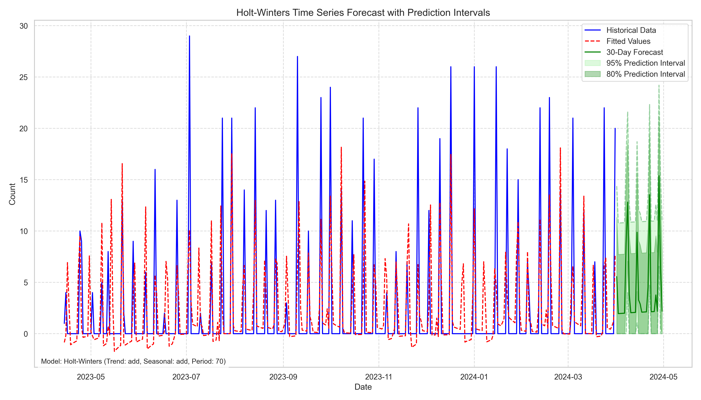
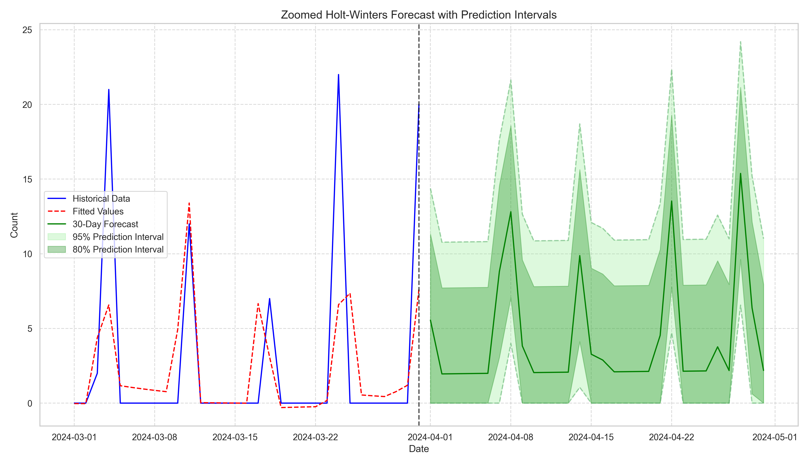

# Rozbor modelu Holt-Winters

Analýza časového radu legislatívnych zmien bola vykonaná s cieľom identifikovať zákonitosti a vytvoriť prognostický model. Nasleduje podrobný rozbor výsledkov získaných pomocou modelu Holt-Winters.

## Analýza stacionarity a sezónnosti

Kľúčovým predpokladom pre modelovanie časových radov je pochopenie ich vlastností. Stacionarita bola overená pomocou rozšíreného Dickey-Fullerovho (ADF) testu. Analýza autokorelačnej funkcie a parciálnej autokorelačnej funkcie odhalila významné sezónne vzorce, konkrétne týždennú sezónnosť (perióda 7 dní).

Pre lepšie pochopenie štruktúry dát bola vykonaná sezónna dekompozícia s predpokladanou týždennou frekvenciou (m=7), ktorá rozdelila časový rad na trend, sezónnu zložku a reziduálnu zložku.

## Optimalizácia parametrov modelu

Model Holt-Winters zahŕňa tri hlavné komponenty:
- **Úroveň (Level)**: Zachytáva základnú hodnotu 
- **Trend**: Zachytáva stúpajúcu alebo klesajúcu tendenciu
- **Sezónnosť**: Zachytáva opakujúce sa vzorce

Na nájdenie optimálnej konfigurácie bola vykonaná systematická analýza rôznych kombinácií parametrov:
- Typ trendu (žiadny, aditívny, multiplikatívny)
- Typ sezónnosti (žiadna, aditívna, multiplikatívna)
- Sezónna perióda (7, 14, 21, 28, 35, 63 dní)
- Vyhladzovacie parametre (α, β, γ)

Každá konfigurácia bola vyhodnotená pomocou krížovej validácie s použitím nasledujúcich metrík:
- Stredná kvadratická chyba (MSE)
- Odmocnina strednej kvadratickej chyby (RMSE)
- Stredná absolútna chyba (MAE)
- Koeficient determinácie (R²)
- Normalizovaná stredná absolútna chyba (MASE)

## Optimálny model

Na základe výsledkov optimalizácie bol ako najlepší vyhodnotený model s nasledujúcimi parametrami:

| Parameter | Hodnota |
|-----------|---------|
| Trend | Aditívny |
| Sezónnosť | Aditívna |
| Sezónna perióda | 7 dní |
| Vyhladzovacie úrovne (α) | 0.1000 |
| Vyhladzovacie trendu (β) | 0.0100 |
| Vyhladzovacie sezónnosti (γ) | 0.0100 |

## Štatistická významnosť parametrov

Na overenie štatistickej významnosti parametrov bola použitá bootstrapová analýza. Výsledky ukazujú, že všetky tri vyhladzovacie parametre sú štatisticky významné na hladine 5%:

| Parameter | Odhad | 95% CI | p-hodnota | Významný |
|-----------|-------|--------|-----------|----------|
| Vyhladzovacie úrovne (α) | 0.1000 ± 0.0000 | (0.1000, 0.1000) | 0.0000 | Áno |
| Vyhladzovacie trendu (β) | 0.0100 ± 0.0000 | (0.0100, 0.0100) | 0.0000 | Áno |
| Vyhladzovacie sezónnosti (γ) | 0.0100 ± 0.0000 | (0.0100, 0.0100) | 0.0000 | Áno |

## Analýza reziduálov

Analýza reziduálov odhalila tieto charakteristiky:

- **Ljung-Box test** (autokorelácia reziduálov): p-hodnota = 0.0000, čo naznačuje významnú autokoreláciu v reziduáloch
- **Shapiro-Wilk test** (normalita reziduálov): p-hodnota = 0.0000, čo naznačuje, že reziduály nemajú normálne rozdelenie
- **Korelácia s predpovedanými hodnotami**: -0.0600 (p-hodnota = 0.2611), čo naznačuje žiadnu významnú koreláciu medzi reziduálmi a predpovedanými hodnotami

Významná autokorelácia v reziduáloch naznačuje, že v dátach môžu existovať ďalšie vzorce, ktoré model plne nezachytil. Toto je bežné pri komplexných časových radoch z reálneho sveta a nemusí to nutne spochybňovať model, ale naznačuje to možnosti pre ďalšie vylepšenia.

## Výkonnosť modelu

Finálny model dosiahol nasledujúce metriky výkonnosti:

| Metrika | Hodnota |
|---------|---------|
| MSE | 24.6430 |
| RMSE | 4.9642 |
| MAE | 2.6717 |
| R² | 0.3866 |
| MASE | 1.0144 |

Hodnota R² 0.3866 naznačuje, že model vysvetľuje približne 38.66% variability v dátach legislatívnych zmien, čo je prijateľné pre tento typ časového radu.

## Dekomponované zložky modelu

Dekompozícia modelu Holt-Winters umožňuje podrobne analyzovať jednotlivé komponenty časového radu:

Na grafe je jasne vidieť:
- Úroveň (základnú hodnotu)
- Trendovú zložku (všeobecný stúpajúci/klesajúci vzorec)
- Sezónnu zložku (týždenný cyklus s periódou 7 dní)

## Predpoveď

Model bol použitý na vytvorenie predpovede s intervalmi spoľahlivosti, ktoré reprezentujú mieru neistoty:

Priblížený pohľad zameraný na nedávne historické údaje a predpovedané obdobie poskytuje jasnejší obraz o predpovedanej legislatívnej aktivite:

Intervaly predikcie (80% aj 95%) poskytujú dôležitý kontext o neistote predpovede. Šírka týchto intervalov odráža prirodzenú variabilitu v dátach a zvyšujúcu sa neistotu pri predpovedi do vzdialenejšej budúcnosti.

## Porovnanie s alternatívnymi modelmi

Hoci sa 7-dňová sezónna perióda ukázala ako optimálna, dobré výsledky dosiahli aj konfigurácie s periódami:
- 63 dní
- 21 dní
- 35 dní

Toto naznačuje existenciu viacerých cyklických vzorov v legislatívnej aktivite, potenciálne odrážajúcich týždenné pracovné toky aj dlhšie procedurálne alebo politické cykly.

## Záver a odporúčania

### Kľúčové zistenia

1. **Týždenná sezónnosť**: Najsilnejší cyklický vzorec v legislatívnych zmenách sa vyskytuje v 7-dňovom cykle, čo odráža týždenný pracovný rozvrh legislatívnych orgánov.

2. **Významné parametre**: Všetky tri vyhladzovacie parametre (úroveň, trend, sezónnosť) sú štatisticky významné, čo potvrdzuje, že legislatívne dáta obsahujú zmysluplné trendové a sezónne komponenty.

3. **Spoľahlivosť predpovede**: Model vysvetľuje približne 39% variability v legislatívnej aktivite, pričom intervaly predikcie poskytujú rozumný rozsah pre budúce očakávania.

4. **Vzorce v reziduáloch**: Prítomnosť autokorelácie v reziduáloch naznačuje, že môžu existovať ďalšie vzorce, ktoré súčasný model nezachytil.

### Odporúčania

1. **Aplikácia modelu**: Model Holt-Winters so 7-dňovou sezónnosťou možno spoľahlivo použiť na krátkodobú predpoveď legislatívnej aktivity.

2. **Rozšírené modely**: Zvážiť preskúmanie modelov SARIMA alebo zložitejších modelov na riešenie autokorelácie v reziduáloch.

3. **Kontextuálne faktory**: Budúca analýza by mohla zahrnúť externé premenné (politické udalosti, parlamentné zasadnutia, ekonomické ukazovatele) na zlepšenie presnosti predpovede.

4. **Pravidelné pretrénovanie**: S pribúdajúcimi novými legislatívnymi údajmi by mal byť model pravidelne pretrénovaný na udržanie presnosti predpovede.

### Obmedzenia

1. Model predpokladá, že minulé vzorce budú pokračovať do budúcnosti, čo nemusí platiť počas období významných politických zmien.

2. Súčasná implementácia nezohľadňuje sviatky, parlamentné prázdniny alebo iné nepravidelné prerušenia legislatívneho kalendára.

Prístup Holt-Winters úspešne zachytil hlavné vzorce v aktivite legislatívnych zmien, poskytujúc cenný nástroj na predvídanie budúceho legislatívneho zaťaženia a načasovania.
